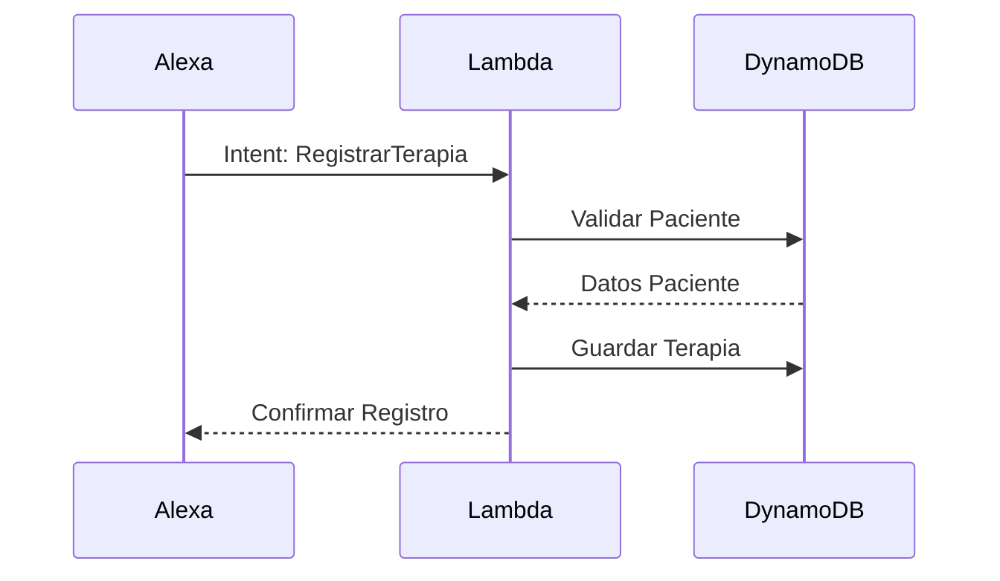
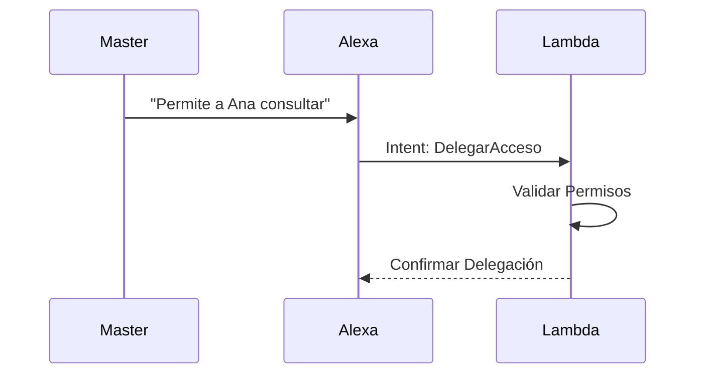

# docs/architecture/system-architecture.md

# Arquitectura del Sistema de Terapias Homeopáticas

## Visión General

El sistema está construido sobre AWS, utilizando servicios serverless para maximizar la escalabilidad y minimizar los costos operativos. La interacción principal se realiza a través de Alexa, permitiendo un control por voz natural e intuitivo.

## Componentes Principales

### 1. Interfaz de Usuario (Alexa Skill)
- **Invocación**: "Alexa, abre terapias homeopáticas"
- **Intents Principales**:
  - Registro de pacientes y terapias
  - Consulta de historiales
  - Gestión de fórmulas
  - Delegación de accesos

### 2. Backend (AWS Lambda)
- **Funciones Core**:
  - Procesamiento de intents
  - Validación de datos
  - Gestión de sesiones
  - Control de acceso

### 3. Base de Datos (DynamoDB)
- **Tablas Principales**:
  ```
  Patients
  ├── PatientID (PK)
  ├── Name
  ├── Phone
  ├── RegisterDate
  └── LastUpdate

  Therapies
  ├── TherapyID (PK)
  ├── PatientID (SK)
  ├── Type
  ├── Date
  └── Observations

  Formulas
  ├── FormulaID (PK)
  ├── Name
  ├── Components
  └── Instructions
  ```

## Flujos de Interacción

### 1. Registro de Terapia


### 2. Delegación de Acceso


## Seguridad y Permisos

### Niveles de Acceso
1. **Maestro**
   - Acceso completo al sistema
   - Capacidad de delegación
   - Gestión de permisos

2. **Aprendiz**
   - Consulta de información autorizada
   - Registro supervisado de terapias
   - Sin acceso a delegación

## Monitoreo y Logs

### CloudWatch Metrics
- Latencia de respuestas
- Errores de procesamiento
- Uso de intents
- Patrones de acceso

### Alertas Configuradas
- Errores críticos
- Latencia elevada
- Fallos de autenticación
